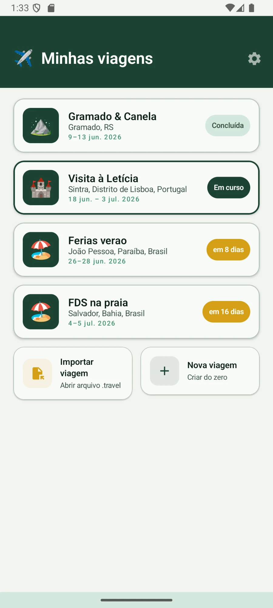
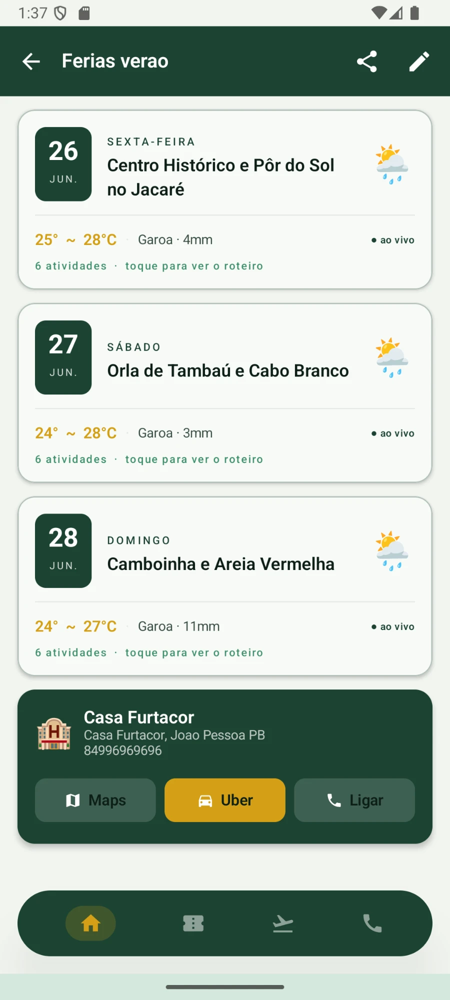
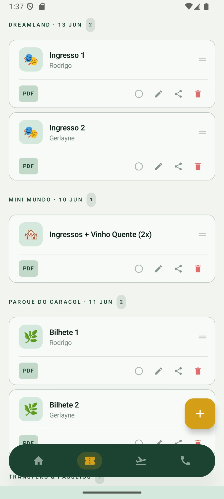
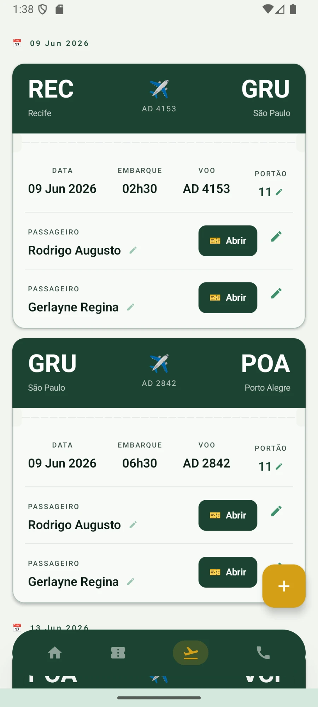
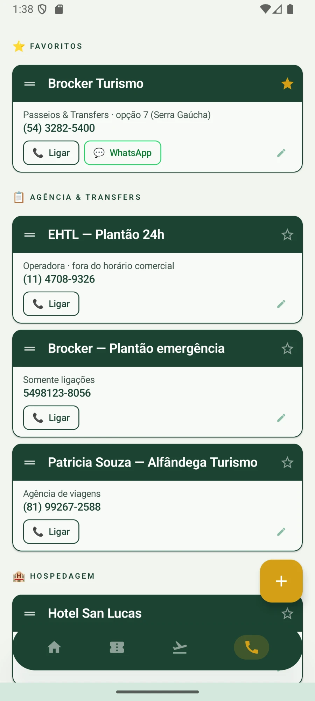
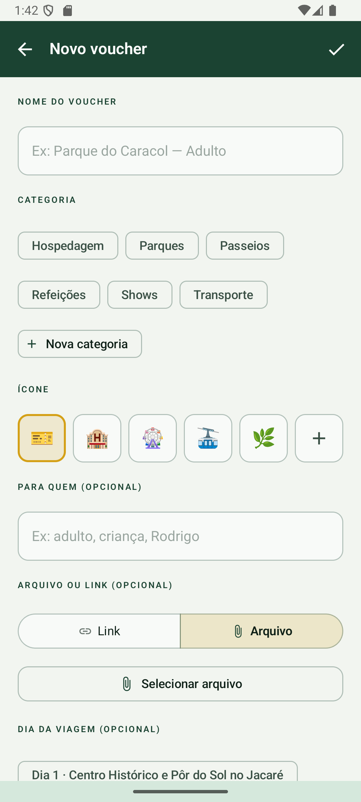

# Rumo — App de Roteiros de Viagem

App Android nativo para organizar roteiros de viagem com previsão do tempo ao vivo, geração de itinerário por IA e compartilhamento entre dispositivos.

## Screenshots

<table>
  <tr>
    <td align="center">
      <br/>
      <sub><b>Lista de viagens</b><br/>Badge de status automático: Concluída, Em curso e countdown de dias. Swipe revela ações de compartilhar, editar e excluir.</sub>
    </td>
    <td align="center">
      <br/>
      <sub><b>Home da viagem</b><br/>Cards por dia com clima ao vivo (Open-Meteo), temperatura e condição. Card do hotel com botões Maps, Uber e Ligar.</sub>
    </td>
    <td align="center">
      <br/>
      <sub><b>Vouchers</b><br/>Cards agrupados por categoria com acento colorido por tipo (PDF/Imagem/Link). Drag-to-reorder por long press e toggle "Usado".</sub>
    </td>
  </tr>
  <tr>
    <td align="center">
      <br/>
      <sub><b>Passagens aéreas</b><br/>Cards adaptativos por tipo de transporte. Cabeçalho com código IATA, número do voo e portão editável. Um card por passageiro.</sub>
    </td>
    <td align="center">
      <br/>
      <sub><b>Contatos</b><br/>Agrupados por categoria com grupo Favoritos no topo. Drag-to-reorder com sombra animada ao arrastar. Botões de ligar e WhatsApp.</sub>
    </td>
    <td align="center">
      <br/>
      <sub><b>Novo voucher</b><br/>Formulário com seleção de categoria, ícone, pessoa, arquivo ou link e dia da viagem. Suporte a categorias personalizadas.</sub>
    </td>
  </tr>
</table>

## Stack

| Camada | Tecnologia |
|---|---|
| Linguagem | Kotlin |
| UI | Jetpack Compose + Material 3 |
| Navegação | Navigation Compose |
| Arquitetura | MVVM (ViewModel + StateFlow) |
| Banco de dados | Room (SQLite) v18 |
| Clima | Open-Meteo API |
| IA | Gemini 2.0 Flash (Google AI) |
| minSdk | 26 (Android 8.0+) |
| targetSdk | 34 |

## Funcionalidades

- **Múltiplas viagens** — crie, edite e exclua viagens; badge de status automático (countdown / Em curso / Concluída)
- **Roteiro diário** — timeline de atividades com horário, emoji, descrição, badges e paradas de caminhada
- **Clima ao vivo** — previsão Open-Meteo por dia de viagem, com cache de 3h e refresh manual
- **Geração de roteiro por IA** — chat com Gemini ou importação de JSON gerado por qualquer IA
- **Compartilhamento `.travel`** — exporta toda a viagem (roteiro, documentos, vouchers) como arquivo ZIP renomeado; importação com um toque
- **Integração com Maps e Uber** — deep links direto de qualquer atividade
- **Documentos por dia** — anexe PDFs ou imagens a cada dia do roteiro
- **Vouchers** — cards com acento colorido por tipo, drag-to-reorder, toggle "Usado", agrupamento por categoria/pessoa/dia (preferência salva por viagem)
- **Configurações** — toggle para abrir automaticamente a viagem em curso; toggle para exibir SAMU, Bombeiros e PM automaticamente nos contatos de todas as viagens
- **Contatos** — agrupados por categoria com grupo Favoritos no topo; favoritar por estrela; swipe para deletar; drag-to-reorder com ordem persistida; card com faixa colorida; contatos fixos de emergência configuráveis
- **Passagens** — suporte a qualquer tipo de transporte (avião, trem, ônibus, navio); card adaptativo com ícone, labels e campos conforme o tipo; anexo de arquivo ou link da passagem; campo de observações; portão de embarque editável (somente voos)
- **Notas** — notas livres por viagem (aba própria) ou por dia, com blocos de texto, checklist e título de seção; editor com drag-to-reorder de blocos e toolbar de inserção; ordenação manual; incluídas no compartilhamento `.travel`

## Setup

### Pré-requisitos

- Android Studio Hedgehog ou superior
- JDK 17 (incluso no Android Studio)
- Dispositivo ou emulador Android 8.0+
- Conta no [Google AI Studio](https://aistudio.google.com) com acesso ao `gemini-2.0-flash` (requer plano pago)

### Configuração

1. Abra a pasta `rumo-app/` no Android Studio
2. Crie o arquivo `local.properties` na raiz do projeto (se não existir) e adicione:
   ```
   GEMINI_API_KEY=sua_chave_aqui
   ```
   > `local.properties` **não deve ser versionado** — já está no `.gitignore`

3. Copie os assets da viagem (se aplicável):
   - PDFs de vouchers → `app/src/main/assets/vouchers/` (mantendo subpastas)
   - Imagem de voo → `app/src/main/assets/vouchers/voo.jpeg`
   - Mapa do Bustour → `app/src/main/assets/images/mapa_rotas_bustour.webp`

4. Sync Gradle e execute

### Comandos

```bash
# Build
./gradlew assembleDebug

# Instalar no dispositivo conectado
./gradlew installDebug

# Testes unitários (JVM)
./gradlew test

# Testes de instrumentação (migrations, DAOs — requer emulador/dispositivo)
./gradlew connectedAndroidTest
```

## Estrutura de pastas

```
app/src/main/
├── java/com/rodrigoleao/gramado2026/
│   ├── MainActivity.kt
│   ├── data/
│   │   ├── model/Models.kt              ← data classes centrais
│   │   ├── ai/ItineraryGenerator.kt     ← Gemini: chat, geração e parse JSON
│   │   ├── db/                          ← Room: database, DAOs, entities, mappers
│   │   ├── export/TravelExporter.kt     ← gera arquivo .travel (ZIP)
│   │   ├── import/TravelImporter.kt     ← importa arquivo .travel
│   │   ├── preferences/SettingsRepository.kt ← SharedPreferences: configurações do app
│   │   ├── repository/                  ← TripRepository, RoteiroRepository
│   │   └── weather/WeatherRepository.kt ← Open-Meteo API + cache
│   ├── navigation/AppNavigation.kt
│   └── ui/
│       ├── splash/SplashScreen.kt
│       ├── trips/                        ← lista, criação e wizard de IA
│       ├── home/HomeScreen.kt
│       ├── day/DayDetailScreen.kt
│       ├── edit/                         ← edição de viagem, dia e atividade
│       ├── share_trip/                   ← compartilhamento .travel
│       ├── import_trip/                  ← importação .travel
│       ├── settings/                     ← SettingsScreen, SettingsViewModel
│       ├── contacts/ContactsScreen.kt
│       ├── vouchers/VouchersScreen.kt
│       ├── components/BadgeChip.kt
│       └── theme/                        ← Color, Type, Theme
├── assets/
│   ├── vouchers/
│   └── images/
└── res/
    └── xml/file_paths.xml               ← FileProvider paths
```

## Formato `.travel`

Arquivo ZIP renomeado com extensão `.travel`. Contém:

```
trip.json          ← roteiro completo (schema v1)
documents/         ← documentos anexados aos dias
vouchers/          ← vouchers e ingressos
boarding/          ← cartões de embarque
```

Veja `docs/travel-export-schema.md` para o schema completo do `trip.json`.

## Banco de dados

Room versão 18. Migrations explícitas em `TravelDatabase.kt` — **nunca usar `fallbackToDestructiveMigration()`**.

Para adicionar campos: crie `MIGRATION_N_(N+1)`, incremente `CURRENT_VERSION`, registre em `ALL_MIGRATIONS` e escreva um teste de migração com `MigrationTestHelper` (ver `docs/guia-testes.md` §1.1).

Os schemas de cada versão são exportados em `app/schemas/` (`exportSchema = true`) — **versionados no git, nunca apagar**: são o histórico que permite testar migrations.

## Paleta de cores

| Token | Uso |
|---|---|
| `GreenMoss` | Primary, TopAppBar, badges de data, hotel card |
| `AmberPrimary` | Accent, snackbar, temperatura, botões "Próximo" |
| `GreenLight` | Background geral |
| `SurfaceWhite` | Cards |

Botões de ação principal: `containerColor = GreenMoss`, ícone/texto `AmberPrimary`.

## Documentação adicional

| Arquivo | Conteúdo |
|---|---|
| `docs/arquitetura-geral.md` | Análise arquitetural completa: camadas, padrões, decisões de design, guia de onde colocar código novo |
| `docs/arquitetura-melhorias.md` | Proposta de modernização: 10 melhorias priorizadas por impacto/esforço (DI, repositórios, domínio, erros, DataStore) |
| `docs/guia-testes.md` | Guia de implementação de testes: 4 fases alinhadas com a sequência de refatoração, dependências, padrões e exemplos por tipo de teste |
| `docs/design-system.md` | Design system completo: paleta, tipografia, formas, componentes recorrentes, hierarquia de botões, princípios visuais |
| `docs/travel-export-schema.md` | Schema do `trip.json`, estrutura do ZIP, regras de import/export |
| `docs/ai-itinerary-schema.md` | Schema JSON para IA, prompt gerado pelo app, modos chat e importar |
| `docs/modulo-01-lista-viagens.md` | Arquitetura e funcionalidades de `TripsListScreen` |
| `docs/modulo-02-home.md` | Arquitetura e funcionalidades de `HomeScreen` |
| `docs/modulo-03-day-detail.md` | Arquitetura e funcionalidades de `DayDetailScreen` |
| `docs/modulo-04-create-trip.md` | Arquitetura e funcionalidades de `CreateTripScreen` (wizard 4 passos + IA) |
| `docs/modulo-05-vouchers.md` | Arquitetura e funcionalidades de `VouchersScreen` |
| `docs/modulo-06-boarding-passes.md` | Arquitetura e funcionalidades de `BoardingPassScreen` e `EditBoardingPassScreen` |
| `docs/modulo-07-contacts.md` | Arquitetura e funcionalidades de `ContactsScreen` |
| `docs/modulo-08-edit-activity.md` | Arquitetura e funcionalidades de `EditActivityScreen` e `EditActivityViewModel` |
| `docs/modulo-09-share-import.md` | Arquitetura e funcionalidades de `ShareTripScreen`, `ImportTripScreen`, `TravelExporter` e `TravelImporter` |
| `docs/modulo-10-settings.md` | Arquitetura e funcionalidades de `SettingsScreen`, `SettingsViewModel` e `SettingsRepository` |
| `docs/modulo-11-navegacao.md` | Arquitetura de `AppNavigation`: rotas, transições, splash, pager de abas, FAB contextual, refresh via `SavedStateHandle`, backstack de importação |
| `docs/modulo-12-notificacoes.md` | Lembrete de check-in: `NotificationHelper` (WorkManager + canal), `CheckInReminderWorker`, `CheckInReminderCard` e permissão `POST_NOTIFICATIONS` |
| `docs/modulo-13-seed-dados-iniciais.md` | Seed da viagem de exemplo: `DatabaseSeeder` (idempotente) e `RoteiroRepository` (fixture de dados iniciais) |
| `docs/modulo-14-categorias-contato.md` | Categorias de contato personalizadas: `ContactCategoryRepository` (SharedPreferences) e uso em `EditContactViewModel` |
| `docs/modulo-15-notas.md` | Notas por viagem/dia (F4): entidades, `NoteRepository`, editor de blocos, lista, navegação e export/import |
