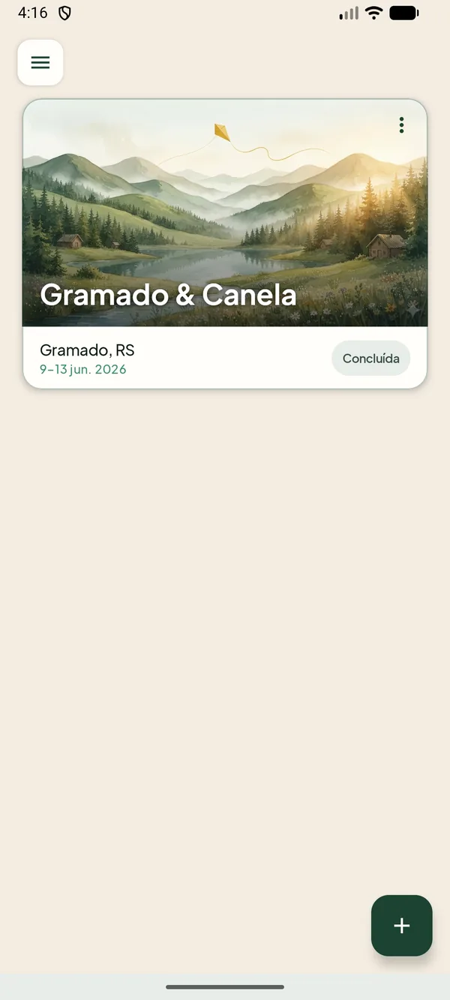
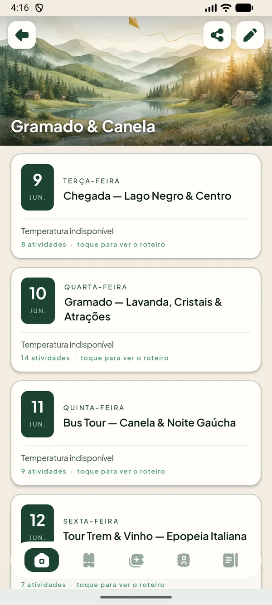
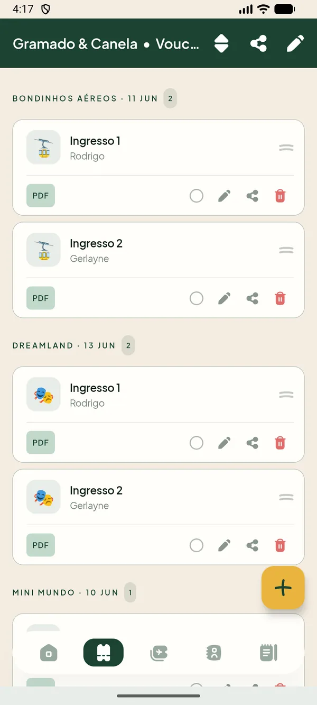
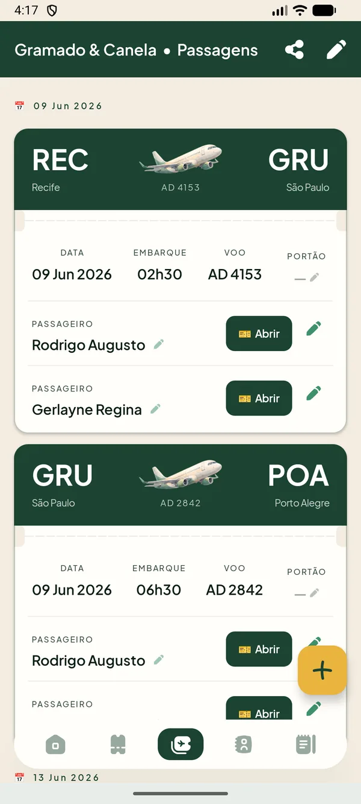
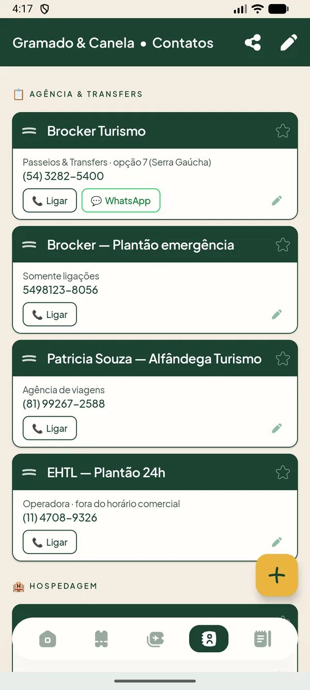
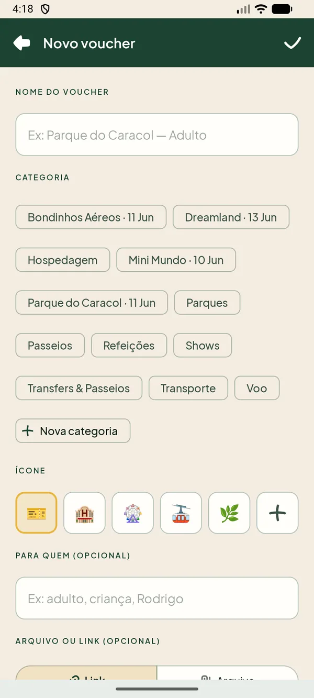

# Pipa — App de Roteiros de Viagem

App Android nativo para organizar roteiros de viagem com previsão do tempo ao vivo, geração de itinerário por IA e compartilhamento entre dispositivos. Identidade visual própria — paleta de marca, tipografia Plus Jakarta Sans, ícones vetoriais e ilustrações.

## Screenshots

<table>
  <tr>
    <td align="center">
      <br/>
      <sub><b>Minhas viagens</b><br/>Cards com ilustração de capa, título sobreposto e badge de status automático (countdown / Em curso / Concluída). Menu ⋮ com compartilhar, editar e excluir. FAB <b>+</b> para criar/importar e botão ☰ que abre a gaveta.</sub>
    </td>
    <td align="center">
      <br/>
      <sub><b>Home da viagem</b><br/>Cabeçalho-capa ilustrado e cards por dia com clima ao vivo (Open-Meteo), temperatura e condição como ilustração da marca. Barra de navegação inferior com 5 abas.</sub>
    </td>
    <td align="center">
      <br/>
      <sub><b>Vouchers</b><br/>Cards agrupados por categoria com miniatura, chip de tipo (PDF/Imagem/Link), toggle "Usado" e drag-to-reorder por long press.</sub>
    </td>
  </tr>
  <tr>
    <td align="center">
      <br/>
      <sub><b>Passagens</b><br/>Cards estilo bilhete, adaptativos por tipo de transporte. Cabeçalho com código IATA, ilustração da marca, número do voo e portão editável. Um botão "Abrir" por passageiro.</sub>
    </td>
    <td align="center">
      <br/>
      <sub><b>Contatos</b><br/>Agrupados por categoria com grupo Favoritos no topo. Drag-to-reorder com sombra animada, swipe para deletar e botões de ligar e WhatsApp.</sub>
    </td>
    <td align="center">
      <br/>
      <sub><b>Novo voucher</b><br/>Formulário com seleção de categoria, ícone, pessoa, arquivo ou link e dia da viagem. Suporte a categorias personalizadas.</sub>
    </td>
  </tr>
</table>

> Screenshots capturados do build **debug** (que semeia a viagem de exemplo "Gramado & Canela").

## Stack

| Camada | Tecnologia |
|---|---|
| Linguagem | Kotlin |
| UI | Jetpack Compose + Material 3 |
| Navegação | Navigation Compose |
| Injeção de dependência | Hilt |
| Arquitetura | MVVM (ViewModel + StateFlow) |
| Banco de dados | Room (SQLite) v19 |
| Preferências | DataStore (Preferences) |
| Imagens | Coil |
| Trabalho em background | WorkManager |
| Drag-to-reorder | `sh.calvin.reorderable` |
| Clima | Open-Meteo API |
| IA | Gemini 2.0 Flash (Google AI) |
| minSdk | 26 (Android 8.0+) |
| compileSdk / targetSdk | 36 |

## Funcionalidades

- **Múltiplas viagens** — crie, edite e exclua viagens; cada card tem ilustração de capa selecionável e badge de status automático (countdown / Em curso / Concluída). Menu ⋮ por card com compartilhar, editar e excluir
- **Tela "Minhas viagens"** — botão ☰ abre uma gaveta (Nova viagem / Importar viagem / Configurações); FAB **+** expansível cria ou importa; altura das capas encolhe conforme a lista cresce (>9 → 2/3, >18 → 1/2)
- **Roteiro diário** — timeline de atividades com horário, ícone, descrição, badges e paradas de caminhada
- **Clima ao vivo** — previsão Open-Meteo por dia de viagem (ilustrações da marca por condição), com cache de 3h e refresh manual
- **Geração de roteiro por IA** — chat com Gemini ou importação de JSON gerado por qualquer IA
- **Compartilhamento `.travel`** — exporta toda a viagem (roteiro, documentos, vouchers, passagens, notas) como arquivo ZIP renomeado; importação com um toque e detecção de duplicata por UUID
- **Integração com Maps e Uber** — deep links direto de qualquer atividade
- **Documentos por dia** — anexe PDFs ou imagens a cada dia do roteiro
- **Vouchers** — cards com miniatura, drag-to-reorder, toggle "Usado", agrupamento por categoria/pessoa/dia (preferência salva por viagem) e categorias personalizadas
- **Passagens** — qualquer tipo de transporte (avião, trem, ônibus, navio); card estilo bilhete adaptativo por tipo; anexo de arquivo ou link; observações; portão de embarque editável (somente voos)
- **Contatos** — agrupados por categoria com Favoritos no topo; favoritar por estrela; swipe para deletar; drag-to-reorder persistido; contatos fixos de emergência configuráveis
- **Notas** — notas livres por viagem (aba própria) ou por dia, com blocos de texto, checklist e título de seção; editor com drag-to-reorder de blocos
- **Configurações** — quatro toggles: abrir automaticamente a viagem em curso; exibir SAMU/Bombeiros/PM nos contatos; ordenar viagens por proximidade; ocultar viagens concluídas

## Setup

### Pré-requisitos

- Android Studio Hedgehog ou superior
- JDK 17 (incluso no Android Studio)
- Dispositivo ou emulador Android 8.0+
- Conta no [Google AI Studio](https://aistudio.google.com) com uma chave de API para o `gemini-3.1-flash-lite` (a chave deve ser de um projeto com quota disponível — projetos com faturamento pré-pago sem crédito retornam `429 RESOURCE_EXHAUSTED`)

### Configuração

1. Abra a pasta `rumo-app/` no Android Studio
2. Crie o arquivo `local.properties` na raiz do projeto (se não existir) e adicione:
   ```
   GEMINI_API_KEY=sua_chave_aqui
   ```
   > `local.properties` **não deve ser versionado** — já está no `.gitignore`

3. Sync Gradle e execute

> Os assets da viagem de exemplo (PDFs de vouchers, imagens, mapa do Bustour) já estão versionados em `app/src/main/assets/`. A viagem "Gramado & Canela" é semeada **apenas em builds debug** (`if (BuildConfig.DEBUG)` no `MainActivity`); o build release nasce sem nenhuma viagem.

### Comandos

```bash
# Build
./gradlew assembleDebug

# Instalar no dispositivo/emulador conectado
./gradlew installDebug

# Testes unitários (JVM)
./gradlew test

# Testes de instrumentação (migrations, DAOs — requer emulador/dispositivo)
./gradlew connectedAndroidTest
```

> O build **release** define um `signingConfig` que lê `keystore/gramado2026.jks` e as propriedades `STORE_PASSWORD`/`KEY_ALIAS`/`KEY_PASSWORD` (passadas via `-P` ou `gradle.properties` não versionado). Sem elas, `assembleRelease` gera um APK **não assinado**, que deve ser assinado à parte com `apksigner`.

## Estrutura de pastas

```
app/src/main/
├── java/com/rodrigoleao/gramado2026/
│   ├── MainActivity.kt                  ← edge-to-edge, splash, seed debug-only
│   ├── PipaApplication.kt               ← @HiltAndroidApp
│   ├── data/
│   │   ├── model/Models.kt              ← data classes centrais
│   │   ├── ai/ItineraryGenerator.kt     ← Gemini: chat, geração e parse JSON
│   │   ├── db/                          ← Room: database, DAOs, entities, mappers
│   │   ├── di/AppModule.kt              ← módulo Hilt (DB, repositórios)
│   │   ├── export/TravelExporter.kt     ← gera arquivo .travel (ZIP)
│   │   ├── import/TravelImporter.kt     ← importa arquivo .travel
│   │   ├── preferences/                 ← SettingsRepository (DataStore) + ContactCategoryRepository
│   │   ├── repository/                  ← TripRepository, NoteRepository, RoteiroRepository (fixture de seed)
│   │   ├── seeder/DatabaseSeeder.kt      ← viagem de exemplo (só em debug)
│   │   └── weather/WeatherRepository.kt ← Open-Meteo API + cache
│   ├── navigation/AppNavigation.kt      ← rotas, pager de 5 abas, FAB contextual
│   ├── notifications/                   ← NotificationHelper + CheckInReminderWorker (WorkManager)
│   └── ui/
│       ├── splash/SplashScreen.kt
│       ├── trips/                        ← lista (drawer/FAB), criação e wizard de IA
│       ├── home/HomeScreen.kt
│       ├── day/DayDetailScreen.kt
│       ├── edit/                         ← edição de viagem, dia, atividade, contato, voucher, passagem
│       ├── share_trip/ · import_trip/    ← compartilhamento e importação .travel
│       ├── settings/                     ← SettingsScreen, SettingsViewModel
│       ├── contacts/ · vouchers/ · boarding/ · notes/
│       ├── components/                   ← BadgeChip, WeatherIcon, TripCovers, ...
│       └── theme/                        ← Color, Type, Theme
├── assets/                              ← vouchers/, images/ (viagem de exemplo)
└── res/
    ├── drawable/                        ← ic_*.xml (ícones vetoriais da marca)
    ├── drawable-nodpi/                  ← ilustrações (cover_*, weather_*, transport_*)
    ├── font/                            ← plus_jakarta_sans_*.ttf
    ├── mipmap-*/                         ← ícone do app (pipa, adaptive + monochrome)
    └── xml/file_paths.xml               ← FileProvider paths
```

## Formato `.travel`

Arquivo ZIP renomeado com extensão `.travel`. Contém:

```
trip.json          ← roteiro completo (schema v1)
documents/         ← documentos anexados aos dias
vouchers/          ← vouchers e ingressos
boarding/          ← cartões de embarque
```

Veja `docs/travel-export-schema.md` para o schema completo do `trip.json`.

## Banco de dados

Room versão **19**. Migrations explícitas em `TravelDatabase.kt` — **nunca usar `fallbackToDestructiveMigration()`**. A versão atual é a única fonte de verdade em `TravelDatabase.CURRENT_VERSION` (usada na anotação `@Database` e nos testes).

Para adicionar campos: crie `MIGRATION_N_(N+1)`, incremente `CURRENT_VERSION`, registre em `ALL_MIGRATIONS` e escreva um teste de migração com `MigrationTestHelper` (ver `docs/guia-testes.md` §1.1).

Os schemas de cada versão são exportados em `app/schemas/` (`room.schemaLocation`) — **versionados no git, nunca apagar**: são o histórico que permite testar migrations.

## Identidade visual

- **Tipografia:** Plus Jakarta Sans (4 pesos embarcados em `res/font/`), ligada em `Type.kt`/`Theme.kt`
- **Ícone do app:** pipa — adaptive icon (`ic_launcher_foreground` + fundo `#1B4332`) com variante monocromática
- **Ícones de interface:** set vetorial próprio (`res/drawable/ic_*.xml`); Material Icons só em pouquíssimos pontos residuais
- **Ilustrações:** capas de viagem (`cover_*.webp`), clima (`weather_*.png`) e transporte (`transport_*.png`)

### Paleta de cores (`ui/theme/Color.kt`)

| Token | Hex | Uso |
|---|---|---|
| `GreenMoss` | `#1B4332` | Primary — top bars, títulos, badges de data, FAB |
| `GreenSage` | `#40916C` | Secondary — datas, ações de suporte |
| `GreenLime` | `#A7C957` | Tertiary — realces frescos |
| `Sand` | `#F4EDE1` | **Background geral do app** |
| `Cream` | `#FAF7F2` | Superfície clara alternativa |
| `SurfaceWhite` | `#FFFDF9` | Cards (branco quente) |
| `GreenForest` | `#E7EDE8` | Nav bar, superfícies suaves |
| `AmberPrimary` | `#E9B43C` | Accent — snackbar, temperatura, FAB de ação |
| `AmberLight` | `#FDF3DD` | Fundo suave de realce âmbar |
| `TextPrimary` | `#0D1F16` | Títulos e texto principal |
| `TextSecondary` | `#3A5045` | Subtítulos, labels, texto auxiliar |

Botões de ação principal: `containerColor = GreenMoss`, ícone/texto `AmberPrimary`.

## Documentação adicional

| Arquivo | Conteúdo |
|---|---|
| `docs/arquitetura-geral.md` | Análise arquitetural completa: camadas, padrões, decisões de design, guia de onde colocar código novo |
| `docs/arquitetura-melhorias.md` | Proposta de modernização: 10 melhorias priorizadas por impacto/esforço (DI, repositórios, domínio, erros, DataStore) |
| `docs/guia-testes.md` | Guia de implementação de testes: 4 fases alinhadas com a sequência de refatoração, dependências, padrões e exemplos por tipo de teste |
| `docs/design-system.md` | Design system completo: paleta, tipografia, formas, componentes recorrentes, hierarquia de botões, princípios visuais |
| `docs/brief-repaginacao-visual.md` | Brief da repaginação visual: metas de identidade de marca, paleta, tipografia, ícones e ilustrações |
| `docs/icones-do-app.md` | Inventário dos ícones e ilustrações da marca e onde são usados |
| `docs/travel-export-schema.md` | Schema do `trip.json`, estrutura do ZIP, regras de import/export |
| `docs/ai-itinerary-schema.md` | Schema JSON para IA, prompt gerado pelo app, modos chat e importar |
| `docs/modulo-01-lista-viagens.md` | Arquitetura e funcionalidades de `TripsListScreen` (gaveta, FAB, ordenação/ocultação, capas responsivas) |
| `docs/modulo-02-home.md` | Arquitetura e funcionalidades de `HomeScreen` |
| `docs/modulo-03-day-detail.md` | Arquitetura e funcionalidades de `DayDetailScreen` |
| `docs/modulo-04-create-trip.md` | Arquitetura e funcionalidades de `CreateTripScreen` (wizard 4 passos + IA) |
| `docs/modulo-05-vouchers.md` | Arquitetura e funcionalidades de `VouchersScreen` |
| `docs/modulo-06-boarding-passes.md` | Arquitetura e funcionalidades de `BoardingPassScreen` e `EditBoardingPassScreen` |
| `docs/modulo-07-contacts.md` | Arquitetura e funcionalidades de `ContactsScreen` |
| `docs/modulo-08-edit-activity.md` | Arquitetura e funcionalidades de `EditActivityScreen` e `EditActivityViewModel` |
| `docs/modulo-09-share-import.md` | Arquitetura e funcionalidades de `ShareTripScreen`, `ImportTripScreen`, `TravelExporter` e `TravelImporter` |
| `docs/modulo-10-settings.md` | Arquitetura e funcionalidades de `SettingsScreen`, `SettingsViewModel` e `SettingsRepository` (DataStore, 4 toggles) |
| `docs/modulo-11-navegacao.md` | Arquitetura de `AppNavigation`: rotas, transições, splash, pager de 5 abas, FAB contextual, refresh via `SavedStateHandle`, backstack de importação |
| `docs/modulo-12-notificacoes.md` | Lembrete de check-in: `NotificationHelper` (WorkManager + canal), `CheckInReminderWorker`, `CheckInReminderCard` e permissão `POST_NOTIFICATIONS` |
| `docs/modulo-13-seed-dados-iniciais.md` | Seed da viagem de exemplo (só em debug): `DatabaseSeeder` e `RoteiroRepository` (fixture de dados iniciais) |
| `docs/modulo-14-categorias-contato.md` | Categorias de contato personalizadas: `ContactCategoryRepository` e uso em `EditContactViewModel` |
| `docs/modulo-15-notas.md` | Notas por viagem/dia (F4): entidades, `NoteRepository`, editor de blocos, lista, navegação e export/import |
| `docs/modulo-16-conversas-ia.md` | Conversas com a IA salvas: entidade `AiConversation`, `AiConversationRepository`, lista e detalhe das conversas |
| `docs/modulo-17-firebase.md` | Firebase: integração base, Crashlytics (relatório de falhas) e Analytics (`AnalyticsService`, eventos e user property `app_language`) |
| `docs/modulo-18-in-app-updates.md` | Atualização in-app (Play In-App Updates, modo flexível): `InAppUpdateManager`, Snackbar global e wiring na `MainActivity` |
```
